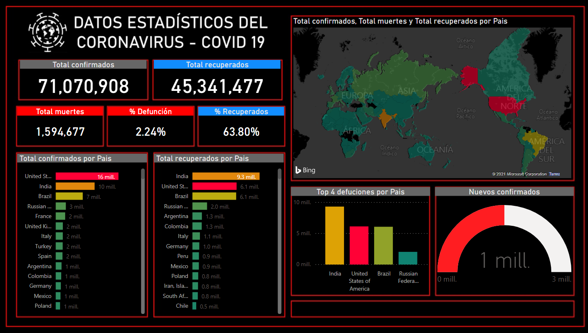

# Covid19Dashboard 📈
Coronavirus disease situation dashboard presents official daily counts of COVID-19 cases and deaths worldwide. 

<h3 align="center"><strong>Covid19</strong></h3>
> This dashboard is developed in Power BI with the COVID19 api

> Access data on COVID19 through an easy API for free. Build dashboards, mobile apps or integrate in to other applications. Data is sourced from Johns Hopkins CSSE

***

